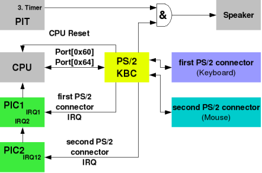

# I/O ports

See [OSDev I/O ports](https://wiki.osdev.org/I/O_Ports)

An I/O port is usually used as a technical term for a specific address on the x86's [IO bus](https://en.wikipedia.org/wiki/Bus_(computing)). This bus provides communication with devices in a fixed order and size, and was used as an alternative to memory access. On many other architectures, there is no predefined bus for such communication and all communication with hardware is done via memory-mapped IO. This also increasingly happens on modern x86 hardware.

Some devices that use I/O ports are hard drives, internal BlueTooth, mouse, keyboard, etc. They are connected to computers via various port like serial port, parallel port, USB port, etc. Each of these type of port provides communication between the device and the processor. We should not looking for a specific devices via a port, as stated by OSDev

>As an operating system developer, you should not be looking for this. "Standardized" I/O ports are only used in some situations, such as hardware that was present on pre-PCI (AT and compatible, etc.) PC hardware. Examples of devices using "standardized" I/O ports are the floppy drive, serial and parallel ports, However, most ports are claimed by plugin cards[which?] you might not have and some[which?] are even assigned via PNP which means that any port could be used for the device in question. If you want access to a device, you will need to look up the details for the device in question, and if some fixed port is involved, it will tell you. It is not technically feasible to have a complete mapping of ports to devices as you won't get access to it

Some important ports:

- PS/2 Controller that deals with mouse and keyboard
- Parallel port
- Serial port

We can read and write to a port (and through that, to the device) via `in` and `out` command

## PS/2

PS/2 is a type of serial communication, typically used for user input devices (keyboard, mouse, bar code scanner, etc). It involves a controller (e.g. "8042 chip" on PC compatible systems), the mechanical and electrical details of the communication itself, and a device

By modern standards you will find many PCs bundled with USB input devices. Some PCs may not even have PS/2 connectors at all. To remain compatible with old software, the mainboard emulates USB Keyboards and Mice as PS/2 devices. This is called USB Legacy Support. Because the implementation differ by manufacturer and mainboard there are flaws and sometimes even bugs. This USB Legacy Support should be disabled by the OS as soon as the OS initializes the USB Controller, and this should be done before the OS attempts to initializes the real PS/2 controller. Otherwise the OS would only initialize the emulated PS/2 controller and there's a large risk of problems caused by deficiencies in the firmware's emulation

Status register give us information about the controller. For example:

- Bit 0 is set means that the controller has data wanting to send out
- Bit 1 is clear means that the controller are free (i.e has finished the previous command) and we can send new command to the controller

## PS/2 Controller

To send a command to the controller, write the command byte to IO port 0x64. If there is a "next byte" (the command is 2 bytes) then the next byte needs to be written to IO Port 0x60 after making sure that the controller is ready for it (by making sure bit 1 of the Status Register is clear). If there is a response byte, then the response byte needs to be read from IO Port 0x60 after making sure it has arrived (by making sure bit 0 of the Status Register is set).

The device like mouse and keyboard will send the data to the port `0x60` on the controller. This port `0x60` is also used to communicate between the processor and the controller itself. This means we use this same port `0x60` to do:

- Send communication data between processor and controller
- Send communication data between devices (mouse, keyboard, etc.) and controller

Because the controller use serial communication, there is a risk of clustering the data. This means we have too many request coming to the same port `0x60`. To prevent this, for processor at least, the processor needs to check the status of controller (via port `0x64`) to see whether it can write send new data to the controller or not. For the devices, we have different methods: polling and interrupts

- Polling is basically the controller waits until of the Status Register becomes set, then read the received byte of data from IO Port 0x60. There are 2 major problems with polling. The first problem is that (like all polling) it wastes a lot of CPU time for nothing. The second problem is that if the PS/2 controller supports two PS/2 devices, there's no way to reliably determine which device sent the byte you received, unless one of them is disabled and unable to send data
- Interrupts: see the image below about the figuration of interrupts and read [Wikipedia Interrupt request x86 IRQs](https://en.wikipedia.org/wiki/Interrupt_request#x86_IRQs). As you can see, the devices can send interrupts signal to the processor, and depending on which IRQ that was sent, we can know which device send the data. Additionally, we can use the IRQ as signal for controller to immediately jump to process the signal the device sent to the controller (see maybe [The AT-PS/2 Keyboard Interface page 9](https://www.tayloredge.com/reference/Interface/atkeyboard.pdf)). This is the preferred method of handling devices data on controller

  