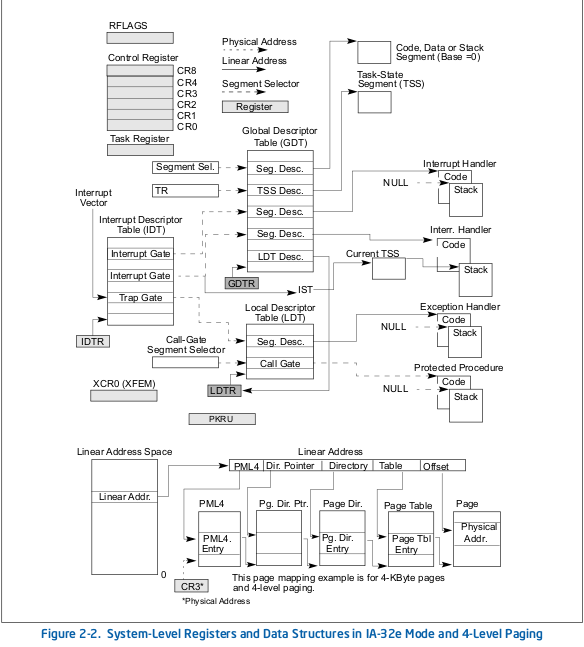
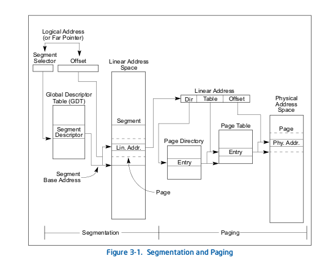

# Memory management

We will talk about memory management in protected mode. Two important concepts in protected mode memory management are Global Descriptor Table (GDT) and Paging. We should also talk about task (also called process), which is the term refers to a running program with its code, data, heap and stack (see [Processes and Threads](https://wiki.osdev.org/Processes_and_Threads)). A task, in most implementation, has its own virtual address space (i.e. its own logical address-to-physical memory mapping) and its own set of system resources (files, environment variable, etc.)

The details can be read in [Intel manual Volume 3 Chapter 3: PROTECTED-MODE MEMORY MANAGEMENT](https://www.intel.com/content/www/us/en/developer/articles/technical/intel-sdm.html#combined)

## Overview

Memory means segments. We have stack segment, code segment, data segment, etc. Global Descriptor Table (GDT) is a table whose entry details about the all memory segment - where is the segment in term of linear address, access level, etc. We also have Task state segment (TSS) that describe the state of the execution environment for a task. Whether it's a memory segment or a TSS, they are all described by descriptor, each has a selector associated with itself. The selector is used to "point" to the descriptor

The name maybe confused, but the descriptor is often call segment descriptor if it describe non-task memory, and TSS descriptor if it describe a TSS. TSS descriptor is a segment descriptor and located in the GDT (see [TSS Descriptor](https://pdos.csail.mit.edu/6.828/2018/readings/i386/s07_02.htm))



In a multi-core processor (i.e processor with multiple cores), each core has its own IA-32 architectural state. Each logical processor consists of a full set of IA-32 data registers, segment registers, control registers, debug registers, and most of the MSRs. This means each processor can have its own "above picture" for it to use, including the GDT - though one GDT for the entire system is often more than enough. See [Intel Manual volume 1 chapter 2.2.8: Intel® Hyper-Threading Technology and 2.2.9: Multi-Core Technology](https://www.intel.com/content/www/us/en/developer/articles/technical/intel-sdm.html#combined), and [Interrupt descriptor table in multiprocessor system](https://stackoverflow.com/questions/48269741/interrupt-descriptor-table-in-multiprocessor-system). For the list of registers, see [Intel Manual volume 1 chapter 3.2: OVERVIEW OF THE BASIC EXECUTION ENVIRONMENT and volume 3 chapter 2.2.4: MEMORY-MANAGEMENT REGISTERS](https://www.intel.com/content/www/us/en/developer/articles/technical/intel-sdm.html#combined) or [OSDev x86-64 registers](https://wiki.osdev.org/CPU_Registers_x86-64)

## Segmentation

Credit to [OSDev Segmentation](https://wiki.osdev.org/Segmentation) and [Intel 64 and IA-32 manual Volume 3](https://www.intel.com/content/www/us/en/developer/articles/technical/intel-sdm.html#combined)

The processor uses byte addressing. This means memory is organized and accessed as a sequence of bytes. Whether one or more bytes are being accessed, a byte address is used to locate the byte or bytes memory. The range of memory that can be addressed is called an **address space**. The processor also supports segmented addressing. This is a form of addressing where a program may have many independent address spaces, called **segments**. For example, a program can keep its code (instructions) and stack in separate segments. Code addresses would always refer to the code space, and stack addresses would always refer to the stack space

---

In **real mode**, you use a logical address in the form A:B to address memory. This is translated into a physical address using the equation:

```asm
Physical address = (A * 0x10) + B
```

The registers in pure real-mode are limited to 16 bits for addressing. 16 bits can represent any integer between 0 and 64k. This means that if we set A to be a fixed value and allow B to change we can address a 64k area of memory. This 64k area is called a segment

In **protected mode**, you use a logical address in the form A:B to address memory. As in Real Mode, A is the segment part and B is the offset within that segment. The registers in protected mode are limited to 32 bits. 32 bits can represent any integer between 0 and 4 GiB. Because B can be any value between 0 and 4GiB our segments now have a maximum size of 4 GiB. The difference here is what A and B means

In protected mode A is not an absolute value for the segment. In protected mode A is a selector. [A selector](https://wiki.osdev.org/Segment_Selector) represents an offset into a system table called the Global Descriptor Table (GDT) (strictly speaking, a selector is more than just an offset to GDT - we can specify the Privilege level, GDT or LDT here, etc. - see [OSDev Segment Selector](https://wiki.osdev.org/Segment_Selector)). The GDT contains a list of descriptors. Each of these descriptors contains information that describes the characteristics of a segment. Each segment descriptor contains the following information:

- The base address of the segment
- The default operation size in the segment (16-bit/32-bit)
- The privilege level of the descriptor (Ring 0 -> Ring 3)
- The granularity (Segment limit is in byte/4kb units)
- The segment limit (The maximum legal offset within the segment)
- The segment presence (Is it present or not)
- The descriptor type (0 = system; 1 = code/data)
- The segment type (Code/Data/Read/Write/Accessed/Conforming/Non-Conforming/Expand-Up/Expand-Down)

For the purposes of this explanation I'm only interested in 3 things. The base address, the limit and the descriptor type. We assume that the descriptor type is 1 (or else it has nothing to do with general addressing). The segment is described by its base address and limit. Remember in real-mode where the segment was a 64k area in memory? The only difference here is that the size of the segment isn't fixed. The base address supplied by the descriptor is the start of the segment, the limit is the maximum offset the processor will allow before producing an exception. So the range of physical addresses in our protected mode segment is

```asm
[Segment Base, Segment Base + Segment Limit]
```

Given a logical address `A:B` (Remember that A is a selector) we can determine the physical address it translates to using:

```asm
Physical address = Segment Base (Found from the descriptor GDT[A]) + B
```

See [Wikipedia Protected mode Segment addressing](https://en.wikipedia.org/wiki/Protected_mode#Segment_addressing)

**Note for C**: short answer is that most C compilers assume a flat-memory model, meaning no segmentation. So, if you're going to use C, do what the rest of the C world does, which is set up a flat-memory model, use paging, and ignore the fact that segmentation even exists. Long answer, read [OSDev Segmentation: Note regarding C](https://wiki.osdev.org/Segmentation#Notes_Regarding_C)

## Task state segment (TSS)

See more on [OSDev Task state segment](https://wiki.osdev.org/TSS) and [Wikipedia Task state segment](https://en.wikipedia.org/wiki/Task_state_segment)

The TSS (see Figure 2-1) defines the state of the execution environment for a task. It includes the state of general-purpose registers, segment registers, the EFLAGS register, the EIP register, and segment selectors with stack pointers for three stack segments (one stack for each privilege level). The TSS also includes the segment selector for the LDT associated with the task and the base address of the paging-structure hierarchy. In old machine without paging, a task will often has locate its segment inside a LDT (hence `LDTR` register stored in the TSS) for security purpose - as an LDT is only visible for the task it belongs to. Paging eliminates such needs

All program execution in protected mode happens within the context of a task (called the current task). The segment selector for the TSS for the current task is stored in the task register (the `TR` register). The simplest method for switching to a task is to make a call or jump to the new task

## Global Descriptor Table (GDT)

In order to switch to protected mode, one of the steps we need to do is to create Global Descriptor Table (GDT). The Global Descriptor Table (GDT) is a binary data structure specific to the IA-32 and x86-64 architectures. It contains entries telling the CPU about memory segments. When operating in protected mode, all memory accesses pass through either the global descriptor table (GDT) or an optional local descriptor table (LDT). These tables contain entries called **segment descriptors**. Segment descriptors provide the base address of segments well as access rights, type, and usage information.

Each segment descriptor has an associated **segment selector**. A segment selector provides the software that uses it with an index into the GDT or LDT (the offset of its associated segment descriptor), a global/local flag (determines whether the selector points to the GDT or the LDT), and access rights information.

To access a byte in a segment, a segment selector and an offset must be supplied. The segment selector provides access to the segment descriptor for the segment (in the GDT or LDT). From the segment descriptor, the processor obtains the base address of the segment in the linear address space. The offset then provides the location of the byte relative to the base address. This mechanism can be used to access any valid code, data, or stack segment, provided the segment is accessible from the current privilege level (CPL) at which the processor is operating. The CPL is defined as the protection level of the currently executing code segment

Big note here: if you see the figure in the Intel manual "System-Level Registers and Data Structures in IA-32e Mode and 4-Level Paging" in volume 3, you will encounter the term physical address, linear address and segment selector. **Segment selector** is just as described above: an entry of GDT/LDT that provide us the base address of a segment. For physical address and linear address, see [What is the difference between linear, physical, logical and virtual memory address?](https://stackoverflow.com/questions/62997536/what-is-the-difference-between-linear-physical-logical-and-virtual-memory-addr). From what I can understand, physical address is the actual address on the physical memory. Logical address is the address of the form `A:B` I mentioned in the segmentation - the address format you use when writing software. Linear address is what you get after calculating the address from logical address `A:B` using Global Descriptor Table. If there is no paging, then Linear address is the same as physical address; if there is paging, then linear address needed to be converted one more time using paging in order to get physical address (see more in [Linear, Logical Address and Physical Address in Microprocessor](https://www.eeeguide.com/linear-logical-address-and-physical-address-in-microprocessor/)). Virtual address is the address before the paging, as paging gives us a lot more address than actual available physical addresses - in a sense, we can say linear address is same as virtual address if paging is used

We also have a very similar **Local Descriptor Table** (LDT). About the difference between GDT and LDT, see [How are LDT and GDT used differently in intel x86?](https://stackoverflow.com/questions/34243432/how-are-ldt-and-gdt-used-differently-in-intel-x86). In simpler term, the difference is that every Task/thread can have its own LDT, and the OS can change the LDT Register (LDTR) on every Task switch; while GDT is system-wide - each processor may have its own GDT, but not every task/thread can have its own GDT. Descriptor for LDT also stored in GDT. See [OSDev Local Descriptor Table](https://wiki.osdev.org/Local_Descriptor_Table) and [Wikipedia Global Descriptor Table, LDT usage](https://en.wikipedia.org/wiki/Global_Descriptor_Table#History). _Modern 32-bit x86 operating systems use the LDT very little_

## Paging

The memory management facilities of the IA-32 architecture are divided into two parts: segmentation and paging. Segmentation provides a mechanism of isolating individual code, data, and stack modules so that multiple programs (or tasks) can run on the same processor without interfering with one another. Paging provides a mechanism for implementing a conventional demand-paged, virtual-memory system where sections of a program’s execution environment are mapped into physical memory as needed. Paging can also be used to provide isolation between multiple tasks. When operating in protected mode, some form of segmentation must be used. **There is no mode bit to disable segmentation**. The use of paging, however, is optional



