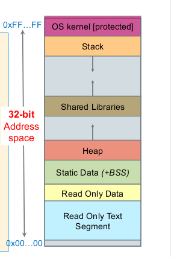

# Object file content

When you compile a program like a C program, you will get a object file. Types of data supported by typical object file formats:

- Header (descriptive and control information)
- [Code segment](https://en.wikipedia.org/wiki/Code_segment) ("text segment", executable code)
- [Data segment](https://en.wikipedia.org/wiki/Data_segment) (initialized static variables)
- Read-only data segment (`rodata`, initialized static constants)
- [BSS segment](https://en.wikipedia.org/wiki/BSS_segment) (uninitialized static data, both variables and constants)
- External definitions and references for linking
- Relocation information
- Dynamic linking information
- Debugging information



This means, the bigger each segment is, the bigger the size of the object file. Remember, the entire object file is loaded into memory in order for the processor to execute instruction, so to lessen the memory usage by the object file, one way is to reduce the size of the object file itself

The code segment is the instruction itself - in other words, our code is pretty much the code segment line by line. We can reduce the size of the code segment by write less instructions, but not only this is impractical, the amount we can reduce by doing it is very small

For the read-only data segment, they are stored in `.rodata` segment. They are for constant data that won't change value during the entire runtime. Traditionally, read-only data was placed in the text section, but later on is put into it own segment `.rodata` (for why, see [What is the reason for having read-only data defined in .text section?](https://stackoverflow.com/questions/51042388/what-is-the-reason-for-having-read-only-data-defined-in-text-section) and [How is read-only memory implemented in C?](https://stackoverflow.com/questions/1704893/how-is-read-only-memory-implemented-in-c)). This segment can be reduced by reducing the amount of constants needed, but is it worth the reducing?

So let look at the data segment and BSS segment

## BSS segment

The BSS segment contains uninitialized static data, both variables and constants, i.e. global variables and local static variables that are initialized to zero or do not have explicit initialization in source code

One question worth asking is, why do we need to separate into BSS `.bss` segment and data `.data` segment? Why not combine those two segments into one? Well, it's to reduce the object file, and also optimization. Because all data in `.bss` segment is for uninitialized variables, we can just represent the entire segment with `0`. This means instead of storing a lot of `0`, the entire `.bss` segment is described by a single number, probably 4 bytes or 8 bytes, that gives its size in the running process. Then during **runtime**, processor will allocate space for all variables that are in `.bss` segment

More details, see [Why is the .bss segment required?](https://stackoverflow.com/questions/9535250/why-is-the-bss-segment-required)

## Data segment

The data segment contains initialized static variables, i.e. global variables and local static variables which have a defined value and can be modified. The `.data` section size is as big as the sum of sizes of the initialized variables

What this means is that, our choice for the global/static variables matters a lot here. For example, if the variable use a big data type (like `uint64_t`) the data segment will be bigger than if the variable use smaller data type (like `uint8_t`)

Consider this program

```c
uint8_t a = 1;
uint8_t b = 2;
uint8_t c = 3;
int main (void) { 
    return 0; 
}
```

Compare with this program

```c
uint64_t a = 1;
uint64_t b = 2;
uint64_t c = 3;
int main (void) { 
    return 0; 
}
```

Compile both into object file by running

```bash
gcc main.c -o main.o
```

And check the size of each segment by running

```bash
size -A -d main.o
```

See [What is c/c++ data segment and stack size?](https://stackoverflow.com/questions/32542041/what-is-c-c-data-segment-and-stack-size)

## Stack and heap

Does stack and heap affect the size of object file?

Luckily, they don't. Object file is generated at compile time (i.e when you compile the program) while stack and heap is generated at runtime (i.e when you run the program)