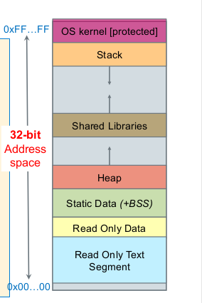

# Overview of OS

A very good guide on Operating System and how to build them [OSDev.org](https://wiki.osdev.org/Expanded_Main_Page)
And a very good intro video is [Building an OS - 1 - Hello world](https://www.youtube.com/watch?v=9t-SPC7Tczc&list=PLFjM7v6KGMpiH2G-kT781ByCNC_0pKpPN)

Terminology for a bit here: a 64-bit processors means that the register for this process is 64 bits. A 32-bit processor means that the register is 32 bit

## How computer find the code for OS

There are two ways for a computer to find the OS:

1. Legacy booting (BIOS)

   This is often used in old, legacy computer. The computer load the **first sector** of every bootable device (like flash drive (USB stick), hard drive, or SSD, etc.) into memory. The computer then search for a signature sequence among the loaded data, and once it found the signature, it will execute the code there

   For detail, see [Boot Sequence](https://wiki.osdev.org/Boot_Sequence)

2. (Unified) Extensible Firmware Interface (UEFI or just EFI)

   The computer look for certain EFI partition on each devices. These are special instruction on how to run the OS. The OS must be compiled as EFI program. Most modern computers use EFI to run the OS

BIOS and UEFI is not mutually exclusive of each other: most device, even modern one, still support booting with BIOS

## Directive vs Instruction

Directive tells the assembler how to compile the program. The directive is not translated to machine code. For example, `function` tell the assembler that the next syntax is a function, or `.word` tell computer that the variable is of word size. This is specific to assembler

Instruction translated into instruction (i.e machine code) that tell the computer what to do. For example, `add` will add two values and write the result into another register

## Memory model

As you can see, anything that is above the User stack (or just Stack for short) belong to the OS kernel and shall not be touched.

Static data and read only data are generated when we start our code. Some examples are global variable, a string, etc. The heap is memory we dynamically allocated on runtime, and stack is filled up when our program run as part of the ,mechanism (like pass parameters to function, function call, etc.)

The read-only text segment store all the instructions for our program. This is different from above segments: the computer will go through instruction by instruction in this segment, and the instruction here will generate the above segments

## Interrupts

See more on [Interrupts](https://wiki.osdev.org/Interrupts) and [BIOS interrupt call](https://en.wikipedia.org/wiki/BIOS_interrupt_call)

Interrupts are signals from a device, such as a keyboard or a hard drive, to the CPU, telling it to immediately stop whatever it is currently doing and do something else. For example, a keyboard controller can send an interrupt when a character key was pressed. Then the OS can display the character on screen immediately, even if the CPU was doing something completely unrelated before, and return to what it was doing afterwards

Three ways to triggered interrupt:

- An exception. Generated internally by the CPU and used to alert the running kernel of an event or situation which requires its attention. For example, Double Fault, Page Fault, etc.
- Hardware. For example, keyboard pressed, timer tick, etc.
- Software Interrupt through `INT` instruction - a software can signal the CPU to indicate it needs attentions. For example, `10h` is video service, `16h` is keyboard I/O, etc.

## Real mode and Protected mode

Before we go into this, let's briefly go through the [memory management system](https://wiki.osdev.org/Memory_Management). So we have physical address - the physical location on the memory and virtual address space - a virtual, non-real address that can be later mapped to a real address. Why virtual? This relieves the executable loader of some relocation work, and solves the memory fragmentation problem - you no longer need physically continuous blocks of memory

The translation from virtual address space to physical address space is done by Memory Management Unit(MMU). There are two main methods in MMU: segmentation (mostly obsolete) and paging

We can have more virtual address than physical address (like in the case with paging). When we try to access a virtual address that don't have corresponding physical address, this can be refer to secondary storage. See [OSDev Virtual Memory](https://wiki.osdev.org/Memory_Management#Virtual_Memory)

### Real mode

See [Real mode Wikipedia](https://en.wikipedia.org/wiki/Real_mode) and [OSDev Real Mode](https://wiki.osdev.org/Real_mode)

Real mode, also called real address mode, is an operating mode of all x86-compatible CPUs. The mode gets its name from the fact that addresses in real mode always correspond to real locations in memory

In Real Mode, there is a little over 1 MB of "addressable" memory (including the High Memory Area). See [Detecting Memory (x86)](<https://wiki.osdev.org/Detecting_Memory_(x86)>) and [Memory Map (x86)](<https://wiki.osdev.org/Memory_Map_(x86)>) to determine how much is actually **usable**. The usable amount will be much less than 1 MB. Memory access is done using **Segmentation** via a `segment:offset` system

The reason for this 1 MB RAM limit is because the register in pure real mode are limited to 16 bits for addressing. So we have 16 bits for the base and 16 bits for the offset - hence the inherent small limit. Why 16 bits though? I don't know - just the fact that real mode assume that the processor is 16 bits

Have no hardware-based memory protection (GDT), nor virtual memory. All modern operating systems (Windows, Linux, ...) run in Protected Mode, due to the many limitations and problems that Real Mode presents

For compatibility purposes, all x86 processors begin execution in Real Mode, and after that continue to Protected Mode

### Protected mode

See [OSDev Protected Mode](https://wiki.osdev.org/Protected_Mode) and [Wikipedia Protected Mode](https://en.wikipedia.org/wiki/Protected_mode)

A CPU that is initialized by the BIOS _starts in Real Mode_. Enabling Protected Mode unleashes the real power of your CPU. However, it will prevent you from using most of the **BIOS interrupts** (just a reminder: only some interrupts are BIOS interrupts), since these work in Real Mode (unless you have also written a V86 monitor)

Protected mode allows system software to use features such as segmentation, virtual memory, paging and safe multi-tasking designed to increase an operating system's control over application software

We can have memory managed by both segmentation and paging, although in modern computer segmentation is, from what I read, is [faded away](https://stackoverflow.com/questions/57222727/is-segmentation-completely-not-used-in-x64)

Protected mode can use paging, which can use bigger size space for memory addressing. For example, 32-bit x86 processors support 32-bit virtual addresses and 4-GiB virtual address spaces, and current 64-bit processors support 48-bit virtual addressing and 256-TiB virtual address spaces

## File system

See [OSDev File System](https://wiki.osdev.org/File_Systems)

File systems are the operating system's method of ordering data on persistent storage devices like disks. They provide an abstracted interface to access data on these devices in such a way that it can be read or modified efficiently

I really like this explanation by [Dennis J Frailey](https://www.quora.com/What-is-the-difference-between-virtual-memory-and-main-memory)

>First of all, let’s define computer memory. Computer memory is where computers keep things that they are working on (programs, data, etc.). There are two important kinds of memory for our purposes: “main” memory (often called RAM) and “secondary” memory (often a disk). Imagine that you were doing a lot of complex work and had a lot of papers and notes and such on your desk, as well as some things you don’t need right away on your bookshelves. The larger your desk, the easier it would be for you to do your work efficiently. And the larger your bookshelves, the more stuff you could keep there. Well, in a way, the “main” memory is the computer’s counterpart to your desk and the “secondary” memory is its counterpart to your book shelves. There are many kinds of computer memory - they come in different sizes and speeds. As a general rule, the faster kinds of memory are smaller than the slower kinds and they are also usually a lot more expensive. The “main” memory (RAM) is where the computer does most of its work. It is usually a fast kind of memory. The “secondary” memory (often a disk of some kind) is where the computer stores the rest of what it needs - it’s a slower kind of memory.
>
>Virtual memory is a way to pretend that the computer has more of this fast, “main” memory than it actually has. The specific details can vary a lot between different computer designs and different operating systems, so I’ll give a somewhat simplified explanation that avoids the details and may not be precisely accurate in every case.
>
>To begin, I’ll explain why you need virtual memory. Suppose you and a friend go to your friendly computer store to buy computers and the sales person says “this computer comes with 8MB of RAM memory, but you have the option of upgrading to 16MB”. Suppose you buy the upgrade and get a 16MB version while your friend decides not to spend the extra money and ends up with the 8MB version. If you take them home and run them side by side you will notice that when the computers are doing a lot of different things (several open windows), the 8MB version is slower, even though the computers have identical processors that run at the same speed. The difference is due to the different sizes of “main” or RAM memory. Each software application (each open window, for example) needs a certain amount of”main” memory in order to function. Altogether you are using so many applications at once that they need a total of more than 8MB of “main” memory. [This is why buying extra RAM memory usually makes your computer faster.]
>
>So what does the computer do when it does not have enough “main” memory for all of the open applications? With virtual memory, it “pretends” there is enough “main” memory. But this “pretend” process slows things down.
>
>Next, I’ll explain how virtual memory works. Here’s the ultra-simple explanation. In a computer that supports virtual memory, you pretend you have a lot of “main” memory, but the fact is that some of the “main” memory is real, RAM memory and some of it is slower memory (usually stored on a disk). The computer is designed in such a way that you can write programs that don’t care which kind of memory you are actually using. The computer gets things from the disk when necessary, and this causes it to run more slowly when that happens.
>
>Here’s a more detailed explanation. All of memory is broken down into blocks called “pages” or “segments”. I’ll assume the blocks are all the same size (there have been systems where they are not, but that needlessly complicates the explanation). A block of memory might be 4KB in size. There are two “main memories” visible to the computer: virtual memory and real memory. The “virtual” memory is an imaginary “main” memory that actually consists of some real “main” memory and some “secondary” memory. The computer pretends that it is just one really large “main” memory. In most implementations, virtual memory is so large that it contains as much memory as the computer can possibly utilize (this is determined by a hardware feature known as the size of the address space). [Note that this may be more memory than you can actually buy for the computer - because that much memory might not physically fit into the computer or might draw so much power that the computer’s power supply couldn’t handle it, or for other technically complex reasons.]
>
>This huge virtual memory is broken down into blocks (4KB each in our example). Real “main” memory consists of a smaller amount of fast memory, also divided into blocks of the same size. The computer operates as though every possible memory location in virtual memory actually exists in real “main” memory.
>
>So what happens when the computer wants something in virtual memory that isn’t actually there in “main” memory? There is a large table maintained by the operating system (often with help from the hardware) that tells which blocks occupy real RAM memory and which ones do not. When a software program needs to use a memory cell, the computer first determines which block it is in (this is very easy and fast). If a block is in real memory, the table indicates where it is in real memory and the computer just goes there and accesses it. If the block is not in real memory, the table indicates where it is on a secondary storage device such as a disk. So when the computer wants something from a block of memory that isn’t really there, it goes to the disk and “swaps” the block into real main memory (in exchange for some other block of memory that is “swapped out” to the disk). This, of course, takes some time and, thus, is much slower.
>
>To summarize, each time the computer wants to access something in memory, the hardware looks at the table and decides what to do - go to the designated location in real memory or swap something from the disk.
>
>Finally, I’ll talk about some related issues.
>
>For one thing, virtual memory makes it possible to write software applications that work in the exact same way whether the computer has a lot of “main” memory or a small amount. This is a very important benefit. I used to work on systems that did not have virtual memory and software often had to be very complicated in order to work properly on different size memory systems.
>
>There has been a lot of creative design in the computer and operating system worlds to make virtual memory systems work a little faster than what I’ve described above. But they are still slower than systems that have larger amounts of “main” memory.
>
>Virtual memory is a concept that requires very intimate interaction between the operating system and the hardware, thus it is one of the earliest examples where the software and hardware communities worked together to make computers better

### File System vs Memory Management

File system is not the same as memory management. With memory management, we are mainly dealing with memory (i.e think of RAM), whereas file system we deal with storage device (think of hard drive or SSD). See [What is the difference between file system and virtual memory in terms of speed and why if they both are in HDD?](https://www.quora.com/What-is-the-difference-between-file-system-and-virtual-memory-in-terms-of-speed-and-why-if-they-both-are-in-HDD) or the video [Lecture 14: File system and memory](https://www.youtube.com/watch?v=kUdtZihMWBg)

First, think about the [definition of file](https://cseweb.ucsd.edu/classes/sp16/cse120-a/applications/ln/lecture15.html). File is an abstraction. It is a collection of data that is organized by its users. The data within the file isn't necessarily meaningful to the OS, the OS many not know how it is organized -- or even why some collection of bytes have been organized together as a file. None-the-less, it is the job of the operating system to provide a convenient way of locating each such collection of data and manipulating it, while protecting it from unintended or malicious damage by those who should not have access to it, and ensuring its privacy, as appropriate. A file system is nothing more than the component of the operating system charged with managing files. It is responsible for interacting with the lower-level IO subsystem used to access the file data, as well as managing the files, themselves, and providing the API by which application programmers can manipulate the files

In other words, the file system provides a way of translating from a given name to data - the program don't need to care about how the data is stored. This could works nicely with [virtual memory](https://wiki.osdev.org/Memory_Management#Virtual_Memory): on paging, when we need to write to secondary storage (like hard drive or SSD), the file system is the one that give instruction on how and where to write to - the same also true when paging we want to swap data

Maybe this answer from the Quora question can help [Intuitively, how does virtual memory management interact with file system management?](https://www.quora.com/Intuitively-how-does-virtual-memory-management-interact-with-file-system-management)

>That has a number of different kinds of answers depending on the kernel design, and how the kernel interacts with the filesystem itself.
>
>In the SIMPLE case, a user application references a memory location… And the memory management unit identifies the address as “non-existent”, causing an interrupt. The CPU has to save the current state (again simplified, the current PC is saved pointing at the address of the instruction making the reference).
>
>The kernel then looks at the table the MMU was using and the address that caused the fault. The missing entry is then identified as to the location on a disk where the memory page was stored. The disk driver is then directed to retrieve that block and add it to the system buffers (busy), and the MMU reference now updated to the ACTUAL memory page used. Now the instruction can be resumed (or restarted) when the MMU interrupt is dismissed.
>
>A FILESYSTEM tends to only get involved IF it is used to allocate disk space for the page file. The kernel then retrieves the map of the data blocks allocated for the file and uses that as a list of blocks available to hold pages (hence page “file”).
>
>Sometimes the handling of a page fault requires a page to be written to disk (in which case the MMU table for the affected process gets marked as invalid) and the page is written to a free block in the list of available blocks. The page just written can then be loaded from a different block before the kernel updates the table for the MMU interrupt.
>
>What makes it really complicated is that multiple programs may have page faults outstanding at the same time. It is up tot he kernel to keep track of it all with each task/process that is active.
>
>The filesystem itself doesn’t interact other than providing the kernel with the list of blocks that can be used for page activity.