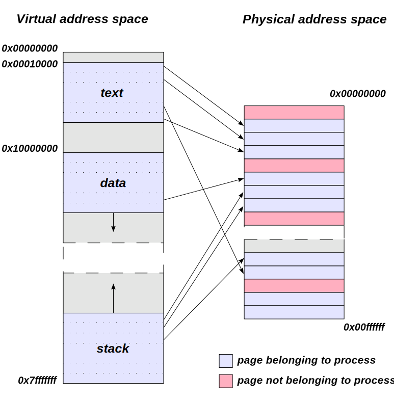

# Protected mode

See [OSDev protected mode](https://wiki.osdev.org/Protected_Mode), [Wikipedia protected mode](https://en.wikipedia.org/wiki/Protected_mode). For documentation, see [Intel 64 manual Volume 3 chapter 10: PROCESSOR MANAGEMENT AND INITIALIZATION](https://www.intel.com/content/www/us/en/developer/articles/technical/intel-sdm.html#combined). For vide guide, see [Protected mode: how your OS can protect itself](https://www.youtube.com/watch?v=EBdzWFyKZ0U)

Protected mode is the mode used by most modern operating system as it offers more security and system stability, as compared to real mode. Two very important features protected mode offer is privilege level and paging

1. **Privilege level**

    In protected mode, there are four privilege levels or rings, numbered from 0 to 3, with ring 0 being the most privileged and 3 being the least. The use of rings allows for system software to restrict tasks from accessing data, call gates or executing privileged instructions.  In most environments, the operating system and some device drivers run in ring 0 and applications run in ring 3

    When application want resource from operating system, like more memory or CPU usage, it needs to make an **system call** to ask kernel for more resource. The kernel can decide whether to grant this or not. When the asking happen (i.e the system call), the processor will be switched to ring 0 to process the system call. When this is done, the processor switches back to its original ring level to continue execute the program

2. **Paging**

    Before going to paging, let's talk about segmentation. In real mode, segmentation maps to a real, physical memory location and a memory address can be used by any running program. There is no memory protection, which can lead to a lot of problems. For example, a program can accidentally write to memory used by OS and crash the whole system, or a malicious program can access OS data and modify it, etc. In protected mode, segmentation still map to a physical memory, but now have to do this through a descriptor table. Each entry of this table corresponds to a memory address, and the segmentation address now contains a "code" to tell its privilege level. Still, most modern OS no longer use segmentation and only really uses it as back-up

    Most modern system use paging. This allows for complete virtualization of memory space: now a memory address no longer map directly to a physical memory address. Through paging, system software can restrict and control a task's access to pages, which are sections of memory. In many operating systems, paging is used to create an independent virtual address space for each task, preventing one task from manipulating the memory of another. Paging also allows for pages to be moved out of primary storage and onto a slower and larger secondary storage, such as a hard disk drive. This allows for more memory to be used than physically available in primary storage

    

## Enter protected mode

There are several steps needed to be done in order to enter protected modes

- Disable interrupts, including NMI (as suggested by Intel Developers Manual).
- Enable the A20 Line.
- Load the Global Descriptor Table with segment descriptors suitable for code, data, and stack

### Disable interrupts

We primarily want to disable maskable interrupts (interrupts that get passed to processor) for several reasons (see [Why we need to disable all interrupts at system startup or system initialization?](https://stackoverflow.com/questions/34947408/why-we-need-to-disable-all-interrupts-at-system-startup-or-system-initialization)). Intel manuals say we can disable non-maskable interrupt (interrupt that indicate hardware failure) but this often not needed. To disable interrupt, we can do

```asm
cli         ; disable interrupts
```

### Enable A20 line

This is legacy reason (see [Wikipedia A20 line](https://en.wikipedia.org/wiki/A20_line)). In short, the early Intel 8086 has only 20 lines (number from `A0` to `A19`) that can only access up to 1 MB. When the processor 8086 try to access more than 1 MB, the address line will wrap around to 0x0000. This quirk is used in some early program for whatever reason. Later processors have more than 20 lines and can access more than 1 MB of memory. However, for backward compatibility with 8086 (the wraparound in particular), the line `A20` is default to be **disabled** at start-up so that modern processor when running code that uses the wraparound quick still be able to leverage that quirk. We want to **enable** line `A20` when we switch to protected mode so that we can get access to all memory we can access (more than 1 MB)

### Load Global Descriptor Table (GDT)

See [OSDev Global Descriptor Table](https://wiki.osdev.org/Global_Descriptor_Table) and [GDT Tutorial](https://wiki.osdev.org/GDT_Tutorial)

Really not much to say here. Just follow the instructions in the two links above. Here is the code that load the GDT in Assembly - credit to [nanobyte - Protected mode: how your OS can protect itself](https://www.youtube.com/watch?v=EBdzWFyKZ0U)

```asm
LoadGDT:
    [bits 16]
    lgdt [g_GDTDesc]
    ret

g_GDT:      ; NULL descriptor
            dq 0

            ; 32-bit code segment
            dw 0FFFFh                   ; limit (bits 0-15) = 0xFFFFF for full 32-bit range
            dw 0                        ; base (bits 0-15) = 0x0
            db 0                        ; base (bits 16-23)
            db 10011010b                ; access (present, ring 0, code segment, executable, direction 0, readable)
            db 11001111b                ; granularity (4k pages, 32-bit pmode) + limit (bits 16-19)
            db 0                        ; base high

            ; 32-bit data segment
            dw 0FFFFh                   ; limit (bits 0-15) = 0xFFFFF for full 32-bit range
            dw 0                        ; base (bits 0-15) = 0x0
            db 0                        ; base (bits 16-23)
            db 10010010b                ; access (present, ring 0, data segment, executable, direction 0, writable)
            db 11001111b                ; granularity (4k pages, 32-bit pmode) + limit (bits 16-19)
            db 0                        ; base high

            ; 16-bit code segment
            dw 0FFFFh                   ; limit (bits 0-15) = 0xFFFFF
            dw 0                        ; base (bits 0-15) = 0x0
            db 0                        ; base (bits 16-23)
            db 10011010b                ; access (present, ring 0, code segment, executable, direction 0, readable)
            db 00001111b                ; granularity (1b pages, 16-bit pmode) + limit (bits 16-19)
            db 0                        ; base high

            ; 16-bit data segment
            dw 0FFFFh                   ; limit (bits 0-15) = 0xFFFFF
            dw 0                        ; base (bits 0-15) = 0x0
            db 0                        ; base (bits 16-23)
            db 10010010b                ; access (present, ring 0, data segment, executable, direction 0, writable)
            db 00001111b                ; granularity (1b pages, 16-bit pmode) + limit (bits 16-19)
            db 0                        ; base high

g_GDTDesc:  dw g_GDTDesc - g_GDT - 1    ; limit = size of GDT
            dd g_GDT                    ; address of GDT
```