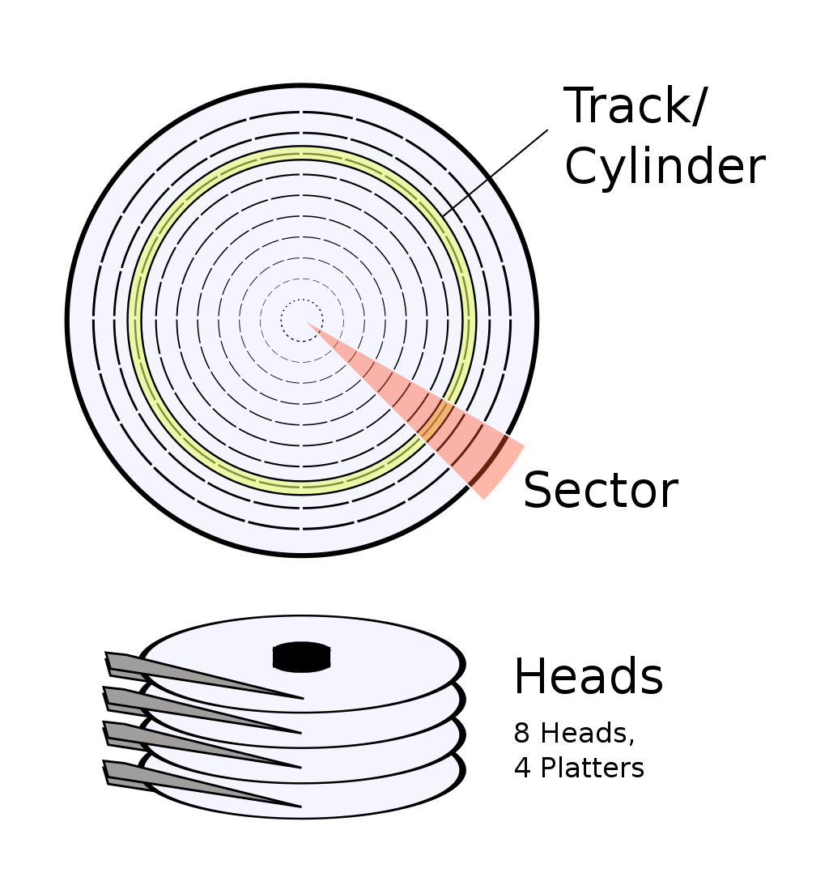

# Read from disk

Currently, all of our instructions for the OS kernel are stuffed into only 512 bytes - the size of a sector. This is not ideal, as 512 bytes is way too small. We cannot go bigger than this without new methods, as by default, computer only recognized the sector that end with `0x55 0xaa` as special boot sector

Our solution would be split the code into two parts: the first part that can be stored in small 512 bytes sector call bootloader; the second part that is bigger and stored in other location is our actual OS kernel code. The bootloader is small and have instructions on how to load the OS kernel code

## Bootloader

The boot loader ultimately has to:

- Bring the kernel (and all the kernel needs to bootstrap) into memory
- Provide the kernel with the information it needs to work correctly
- Switch to an environment that the kernel will like
- Transfer control to the kernel

One option of setting up bootloader would be to put the bootloader in first sector then operating system in second sector. The problem with this is that we wouldn't be able to store any other files aside from OS kernel code in the same disk

### FAT file system layout

See [Design of the FAT file system](https://en.wikipedia.org/wiki/Design_of_the_FAT_file_system) and [OSDEv FAT implementation detail](https://wiki.osdev.org/FAT#Implementation_Details) too see how the field in the file corresponds to the layout of FAT file system

Note on the FAT count. We often have 2 FAT because one is for redundancy - see [How FAT (File Allocation Table) works?](https://superuser.com/questions/425251/how-fat-file-allocation-table-works)

Next is the cluster. The data area is divided into identically sized clusters—small blocks of contiguous space. One cluster can consist of multiple sectors (the drive should specify this number at the BIOS parameter block). A file in the file system can span multiple cluster. FAT 12 uses 12 bits to address the clusters. FAT 16 uses 16 bits to address the cluster. We only care about cluster when we are in the data region, as boot record, FAT region and Root Directory Region don't use cluster as measurement

The clusters of a file need not be right next to each other on the disk. In fact it is likely that they are scattered widely throughout the disk. Thus, a file is represented by a chain of clusters (referred to as a singly linked list). The FAT allows the operating system to follow the "chain" of clusters in a file. Each entry of the FAT contain a pointer that points to next cluster

The address to the cluster that contain the file is divided into high and low: the high two bytes is stored in `0x14` offset and the low is stored in `0x1A` offset

The FAT12 file system uses 12 bits per FAT entry. The FAT16 file system uses 16 bits per FAT entry. The File Allocation Table (FAT) is a contiguous number of sectors immediately following the area of reserved sectors. It represents a list of entries that map to each cluster on the volume. Each entry records either one out of five things:

- the cluster number of the next cluster in a chain
- a special end of cluster-chain (EOC) entry that indicates the end of a chain
- a special entry to mark a bad cluster
- a zero to note that the cluster is unused

~~ The first two cluster is reserved so you cannot write to those cluster.~~. The first two entries in a FAT store special values. Clusters are index from 0. We get the sector number from the cluster by doing

```c
first_sector_of_cluster = ((cluster - 2) * fat_boot->sectors_per_cluster) + first_data_sector;
```

We can think of each entry for the FAT as the record of the cluster. For example, the first entry (0th) record the cluster that the first cluster (0th) point to. The second entry (1st) record the cluster that the second cluster (1st) point to. So on and so forth. Because as we say above, the first two (2) entries of the FAT are reserved, we can only use cluster starting from the third cluster (2nd). **This third cluster will point to the first sector of the data region**

Hence why we need to subtract `2` from the formula above. To see all the formula for calculation, see [OSDev FAT Programming Guide](https://wiki.osdev.org/FAT#Programming_Guide)


### Format for FAT file system

The device/image file that have FAT file system must have the correct bytes sequence at the start of the device/image. See [OSDEv implementation detail](https://wiki.osdev.org/FAT#Implementation_Details). If you are using Assembly, here is the setup

```asm
;
; FAT12 header
; 
jmp short start
nop

bdb_oem:                    db 'MSWIN4.1'           ; 8 bytes
bdb_bytes_per_sector:       dw 512                  ; because all numbers are in the little-endian format
bdb_sectors_per_cluster:    db 1
bdb_reserved_sectors:       dw 1
bdb_fat_count:              db 2
bdb_dir_entries_count:      dw 0E0h
bdb_total_sectors:          dw 2880                 ; 2880 * 512 = 1.44MB
bdb_media_descriptor_type:  db 0F0h                 ; F0 = 3.5" floppy disk
bdb_sectors_per_fat:        dw 9                    ; 9 sectors/fat
bdb_sectors_per_track:      dw 18
bdb_heads:                  dw 2
bdb_hidden_sectors:         dd 0
bdb_large_sector_count:     dd 0

; extended boot record for FAT 12
ebr_drive_number:           db 0                    ; 0x00 floppy, 0x80 hdd, useless
                            db 0                    ; reserved
ebr_signature:              db 29h
ebr_volume_id:              db 12h, 34h, 56h, 78h   ; serial number, value doesn't matter
ebr_volume_label:           db 'HELLO OS   '        ; 11 bytes, padded with spaces
ebr_system_id:              db 'FAT12   '           ; 8 bytes
```

Notice how we write bytes sequence into the drive. These are all directive and are default to be put at the beginning of the compiled file (i.e when we compile the file into instruction). It would be very helpful if you format a test image to check what is the setup of a typical FAT look like. If this all go well, we can check whether this actually works or not by running

```bash
# the -i is need to specify the image/device to be used as input
mdir -i your_file.img

Volume in drive : is NBOS       
Volume Serial Number is 7226-5612
Directory for ::/

kernel   bin       512 2022-08-02   6:53 
        1 file                  512 bytes
                          1 457 152 bytes free


```

## Disk layout

For hard drive, we have multiple platters - the circular disk in the drive. We can read/write to both sides of the platter, and to do this, we need two heads for each platter: one head for the top side, one head for bottom side of the platter. A platter can be divided into sector and track/cylinder in which we store data upon (see image below)



There are two ways to address a block: Cylinder-head-sector (CHS) and Logical block addressing (LBA). LBA is the modern way of addressing the block on a disk, and  the formula to convert from LAB to CHS is as such (from [OSDev LBA](https://wiki.osdev.org/LBA))

```c
// this assume that both side of a platter can be read/write
// which means each platter has two heads
void ToCHS(int lba, int *head, int *track, int *sector)
{
        (*head) = (lba % (SECTORS_PER_TRACK * 2)) / SECTORS_PER_TRACK;
        (*track) = (lba / (SECTORS_PER_TRACK * 2));
        (*sector) = (lba % SECTORS_PER_TRACK + 1);
}
```

Or you can check out the formula in [Wikipedia LBA](https://en.wikipedia.org/wiki/Logical_block_addressing)

In a disk we have the concept of sector and cluster. Sector is smallest Addressable Unit (mostly 512 bytes), while cluster is the smallest Allocation Unit (equals to 1 or more sectors and the number of clusters depends on the file system). See [sectors and clusters](https://superuser.com/questions/119446/sectors-and-clusters)

A cluster is a group of contiguous sectors. The cluster size is the number of sectors per cluster, which is set when the filesystem is created (formatted) and cannot be changed after the fact without reformatting the filesystem with a different cluster size.

Why we need to separate into sector and cluster and why not make then one thing? Well, the advantage of file systems considering a cluster/allocation unit/block as the smallest unit, is because addressing the entire disk per-sector would require a larger number of bits to index it all. See [What is the difference between sector and cluster?](https://superuser.com/questions/974824/what-is-the-difference-between-sector-and-cluster)

## Disk access using BIOS

When BIOS start, it loads into register `dl` the drive number of the drive it uses to boot. See [PC boot: dl register and drive number](https://stackoverflow.com/questions/11174399/pc-boot-dl-register-and-drive-number) and [BIOS Boot to D](https://theartofmachinery.com/2017/01/24/boot_to_d.html)

We can access disk using BIOS with `INT 13h`. Be careful with this as modern computer has move away from BIOS, and if you run the computer in protected mode (which most modern computer does) this probably won't even work

Detail see [Disk access using the BIOS (INT 13h)](https://wiki.osdev.org/ATA_in_x86_RealMode_(BIOS))

## Load file to memory

See [OSDev Memory Map (x86)](https://wiki.osdev.org/Memory_Map_(x86))